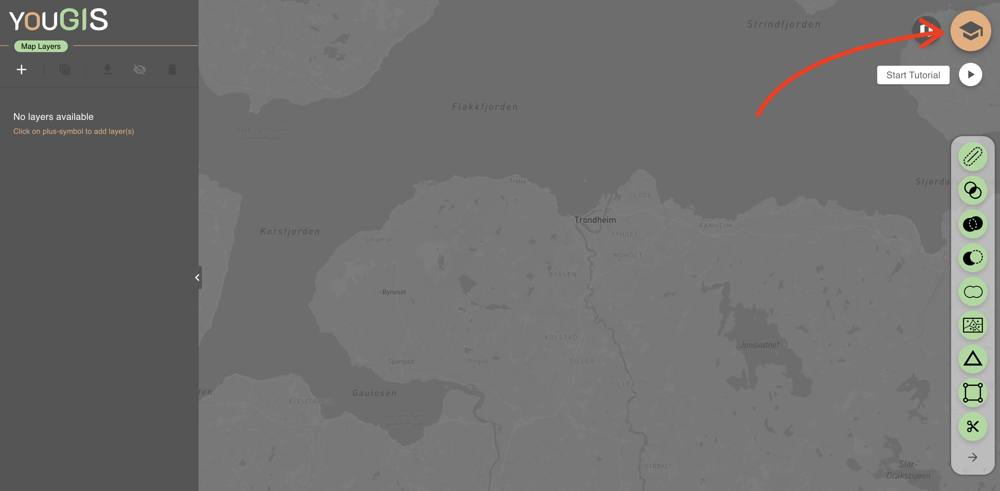

# 

Welcome to the **YouGIS**, a web GIS application developed as part of the NTNU 4th year course **TBA4251 "Programming in Geomatics"**. This application is designed for non-professional GIS users with minimal experience in geospatial data analysis. By offering an intuitive and visually appealing user interface, the goal is to give beginner a good start to the world of GIS. The application can be used for basic geographic data processing and visualization.

Click on this link to try the live web application: [YouGIS](https://pederundheim.github.io/YouGIS/)

---

## **Features**

- Upload/draw and visualize GeoJSON/JSON files in different basemaps
- Perform geoprocessing operations, such as:

  - **Buffer**
  - **Intersect**
  - **Union**
  - **Difference**
  - **Dissolve**
  - **Voronoi-diagrams**
  - **TIN (Triangular Irregular Network)**
  - **Bounding Box (Bbox)**
  - **Clip**
  - **Attribute Table with filtering on attributes**

- Integrated step-by-step tutorial with provided layer data
- Export processed results

---

## **Installation**

Access the application by using the live version, or run the project locally at your computer.

### Live Version

Access the application directly in your browser: [https://pederundheim.github.io/YouGIS/](https://pederundheim.github.io/YouGIS/)

### Run Locally

To run the application locally:

1. Clone the repository:
   ```bash
   git clone https://github.com/PederUndheim/YouGIS.git
   cd yougis
   ```
2. Run this to install required packages:
   ```bash
   npm i
   ```
3. You must also include a .env-file at the top level in your project where you include your own Mapbox-token in this file:

   ```bash
   VITE_MAPBOX_TOKEN = "your_mapbox_token"

   ```

4. Run to start application at localhost in your browser:
   ```bash
   npm run dev
   ```

---

## **Usage**

### **Tutorial**

- You find a tutorial which through a mission guides you through the important features of this application. This tutorial also provides example data to work with.

  

- Start the tutorial by hovering over the button showed in the image above, and click `Start Tutorial`.

### **Supported data**

If you want to upload other data than the provided in the tutorial, please ensure these requirements for the files.

- File extension is `.json` or `.geojson`

- Coordinate system:
  - **Projection**: Latitude/Longitude
  - **Datum**: WGS 84
  - **EPSG Code**: 4326

---

## Technology Stack

#### Frontend Framework

- **React**: A powerful library for building interactive user interfaces.
- **MUI (Material-UI)**: Provides a rich library of customizable UI components.
- **Mapbox GL**: Used for interactive map rendering and geospatial data visualization.

#### Geospatial Processing

- **@turf/turf**: A geospatial analysis library for performing complex GIS operations such as intersections, unions, and spatial queries.
- **@mapbox/mapbox-gl-draw**: Enables drawing and editing features directly on the map.

#### Utilities and State Management

- **Lodash** and **lodash.debounce**: For utility functions and optimized event handling.
- **UUID**: For generating unique identifiers.
- **React-DnD** and **@hello-pangea/dnd**: To implement drag-and-drop interfaces.
- **@emotion/react** and **@emotion/styled**: For CSS-in-JS styling.

#### Development and Deployment

- **TypeScript**: A strongly-typed language for JavaScript, ensuring type safety and reducing runtime errors.
- **Vite**: A fast build tool and development server.
- **gh-pages**: For deploying static files to GitHub Pages.

---

## **Further Development**

This project serves as a foundation for simple GIS tasks but has room for growth:

### **Known Issues**

- Layers are not always rendering in correct order, based on which is on top of each other in the list.
- Slow performance on very big files

### **Possible Improvements**

- Seamless layer order-handling that works well
- Support for more file formats (e.g., GML, SOSI, shapefiles, CSV).
- Adding WMS layer integration.
- Compatibility with additional coordinate systems.
- Possibility to make, save and store projects so one can open them later

---

## Acknowledgements

This project is built using a variety of open-source libraries and tools. Special thanks to the following projects and contributors:

- **React**: For providing a dynamic framework for building user interfaces.
- **Mapbox and Turf.js**: For offering comprehensive geospatial tools and libraries.
- **MUI**: For a well-structured, consistent UI design system.
- **TypeScript**: For enhancing code reliability and developer productivity.
- **Vite**: For its fast and efficient development experience.
